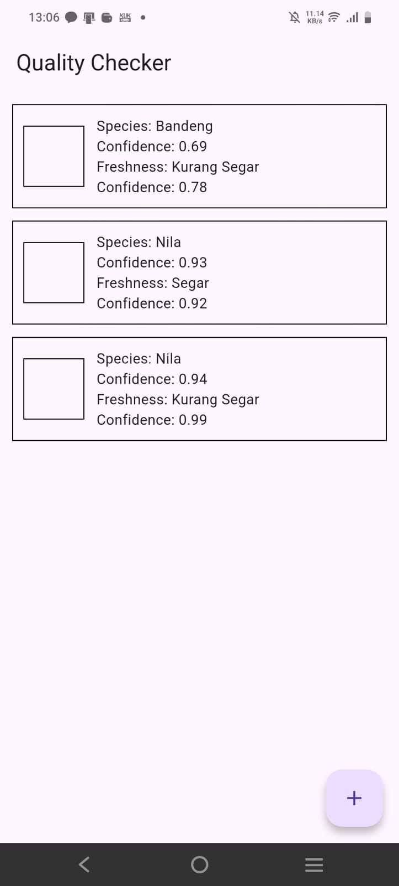
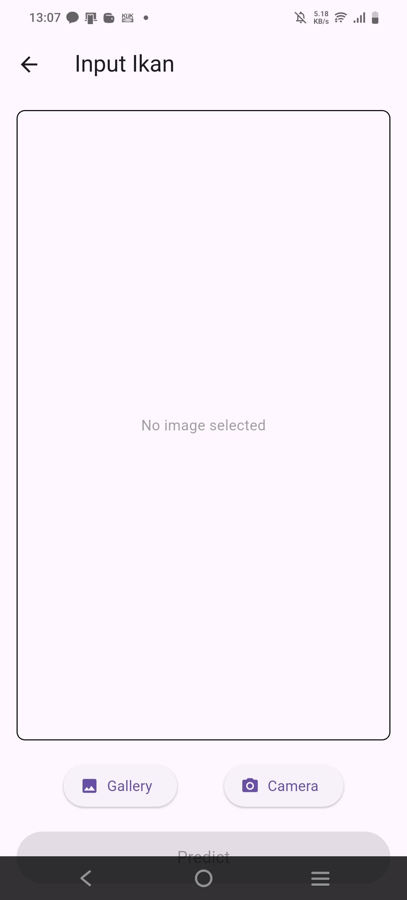
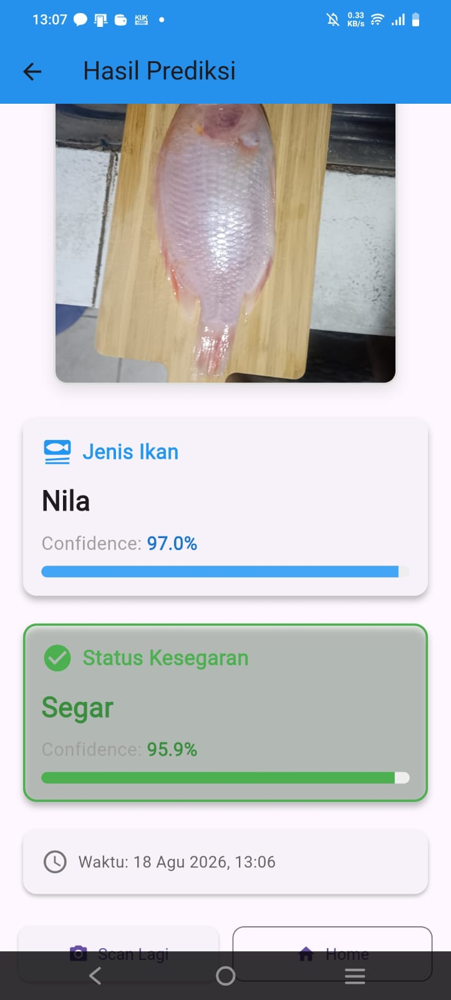

# FQC Application (Fish Quality Checker)

The **FQC Application** is a **prototype Flutter-based mobile application** designed to explore the use of machine learning for **fish freshness detection**.

This application is still in the **experimental stage**, and the freshness prediction results **are not guaranteed to be fully accurate**.

## 🚀 Project Overview

The main purpose of this project is to:

- Explore the application of **machine learning models** in a mobile environment
- Integrate **image-based classification** into a Flutter application
- Serve as a **research and learning prototype**, not a production-ready system

## 🧪 Prototype Disclaimer

> ⚠️ **Important Disclaimer**
>
> This application is a **prototype**, and the freshness detection results should **not be used as a definitive reference** for real-world fish quality assessment.

## 🐟 Supported Fish Types

Currently, the application can only detect the freshness of:

- **Tilapia (Ikan Nila)**
- **Milkfish (Ikan Bandeng)**

Other fish species are **not supported** in this version.

## 🧠 Technology & Approach

- Image-based freshness classification
- Machine learning model integration
- On-device inference using pre-trained models
- Image processing

## 🛠️ Tech Stack

- **Flutter**
- **Dart**
- **TensorFlow Lite**
- **Image Processing**
- **Git & GitHub**

## 📦 Features

- Capture or input fish images
- Predict fish freshness level
- Supports limited fish species
- Offline inference using local ML models
- Simple mobile interface for testing the classification model

## 📱 Screenshots

### 🏠 Home Screen

The main screen of the FQC application.

> **Screenshot Placeholder:** Add the Home Screen screenshot to `screenshots/home-screen.png`.

---

### 📷 Input Screen

The screen where users can capture or select an image of the fish for freshness analysis.

> **Screenshot Placeholder:** Add the Input Screen screenshot to `screenshots/input-screen.png`.

---

### 📊 Result Screen

The result screen displays the predicted freshness classification generated by the machine learning model.

> **Screenshot Placeholder:** Add the Result Screen screenshot to `screenshots/result-screen.png`.
